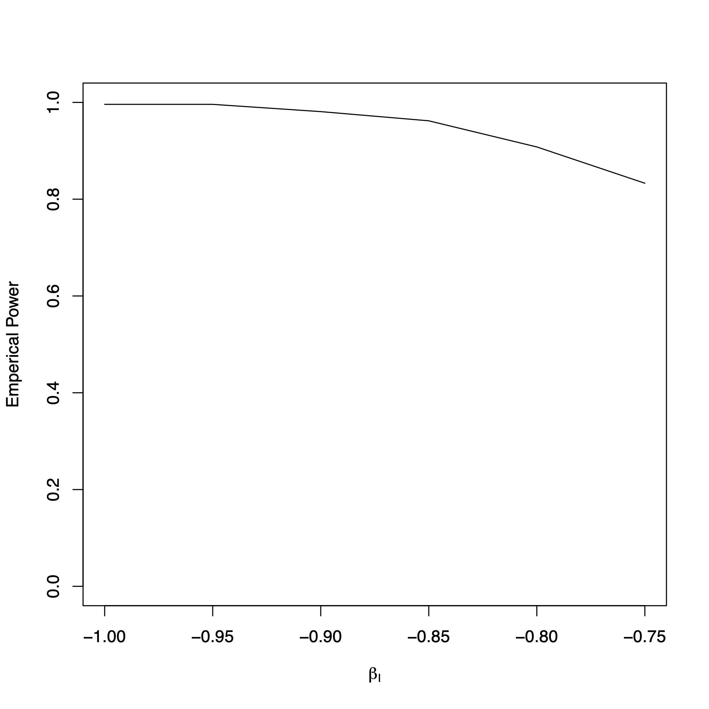

## 
Examine the gene by environment interaction with a binary outcome and a normally distributed environmental exposure.

## Installation
```
install.packages("devtools") # devtools must be installed first

devtools::install_github("SharonLutz/powerGcE")
```

## Input
For n cases and controls (input: nCases, nControls), the SNP is generated from a binomial distribution with a specified MAF (input: MAF) and the environmental exposure E is generated from a normal distributions with user specified mean and variance (input: meanE, varE). The binary outcome Y is generated from a binomial distribution such that:

logit\[P(Y=1)\] = &beta;<sub>0</sub> + &beta;<sub>SNP</sub>SNP + &beta;<sub>E</sub>E + &beta;<sub>I</sub> E*SNP 

where &beta;<sub>I</sub> is inputted as a vector of values (input: betaI). Then, the proportion of simulations where the p-value for the interaction term in a logistic regression is less than the user specified alpha level is calculated.

See the manpage for more detail regarding the input of the function.

```
library(powerGcE)
?powerGcE # For details on this function
```

## Example
For 407 cases and 376 controls, consider a SNP with a MAF of 0.49 and a normally distributed environmental exposure with a mean of 0 and a variance of 0.99. The binary outcome Y is generated such that

logit\[P(Y=1)\] = -0.32 + 0.17SNP + 0.97E + &beta;<sub>I</sub> E*SNP 

where  &beta;<sub>I</sub> varies from -1 to -0.75 by 0.05. The code to run this example is given below.

```
library(powerGcE)
powerGcE(nCase=407,nControl=376,MAF=0.49,meanE=0,varE=0.99,beta0=-0.32,betaSNP=0.17,betaE=0.97,
betaI=seq(-1,-0.75,by=0.05),nSim=1000,alpha=0.00000005,plot.output=T,plot.name="powerGcE.pdf",seed=1)
```

## Output
For this example, we get the following matrix and corresponding plot.

```
     BetaI Proportion
[1,] -1.00 0.996
[2,] -0.95 0.996
[3,] -0.90 0.981
[4,] -0.85 0.962
[5,] -0.80 0.908
[6,] -0.75 0.833
```


## Notes
Please note that the MAF, mean, variances, and &beta;s need to be chosen such that there is enough variability for the SNP, the environmental variable E, and the binary outcome Y.
